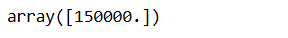

# Implementation-of-Decision-Tree-Regressor-Model-for-Predicting-the-Salary-of-the-Employee

## AIM:
To write a program to implement the Decision Tree Regressor Model for Predicting the Salary of the Employee.

## Equipments Required:
1. Hardware – PCs
2. Anaconda – Python 3.7 Installation / Jupyter notebook

## Algorithm
1. Import required libraries and read the DataFrame using pandas.
2. Calculate the null values present in the dataset and apply label encoder.
3. Determine test and training data set and apply decision tree regression in dataset.
4. Calculate MSE, Data Prediction and R^2.

## Program:

Program to implement the Decision Tree Classifier Model for Predicting Employee Churn.

Developed by: Dhanvant Kumar V                                                                             
RegisterNumber: 212224040070

```python 
import pandas as pd
data=pd.read_csv("Salary.csv")
data.head()

data.info()

data.isnull().sum()

from sklearn.preprocessing import LabelEncoder
le=LabelEncoder()
data["Position"]=le.fit_transform(data["Position"])
data.head()

x=data[["Position","Level"]]
x.head()

y=data[["Salary"]]
from sklearn.model_selection import train_test_split
x_train, x_test, y_train, y_test=train_test_split(x,y,test_size=0.2,random_state=2)

from sklearn.tree import DecisionTreeRegressor
dt=DecisionTreeRegressor()
dt.fit(x_train,y_train)
y_pred=dt.predict(x_test)

from sklearn import metrics
mse=metrics.mean_squared_error(y_test, y_pred)
mse

r2=metrics.r2_score(y_test,y_pred)
r2

dt.predict([[5,6]])
```

## Output:
### Head data

### Info on Data

### Sum of Null values

### Transformed DataFrame's Head data

### Head data of variable 'x'

### Mean Squared Error

### R^2 Score

### Data Prediction



## Result:
Thus the program to implement the Decision Tree Regressor Model for Predicting the Salary of the Employee is written and verified using python programming.
